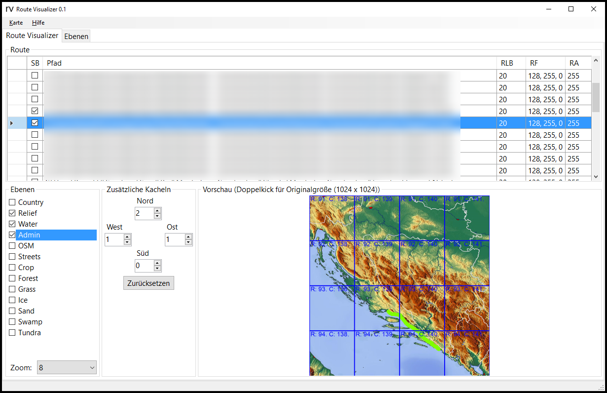

**Dieses Projekt befindet sich derzeit im Aufbau.**

# Route-Visualizer

*Route Visualizer* ist ein Programm um Koordinaten aus <tt>kml</tt>-Dateien auf eine Karte zu zeichnen. Das Resultat ist eine hochaufgelöste Bilddatei.

* Die aktuelle Version kannst du hier herunter laden.
* Schnelle Hilfe findest du im [Wiki](https://github.com/DAccord/Route-Visualizer/wiki).
* Wenn du einen Fehler gefunden hast oder einen Vorschlag für eine neue Funktion hast, erstelle ein [Issue](https://github.com/DAccord/Route-Visualizer/issues).

